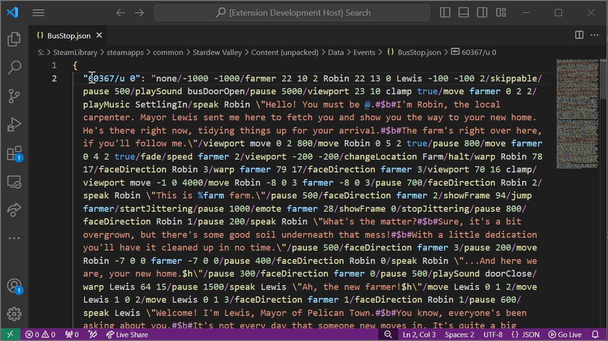

<h1 align="center"> Stardew Syntax</h1>

## About
Stardew Syntax provides syntax highlighting for Stardew Valley's dialogue and events.
Syntax highlighting is applied to files with either the `.sdvevent` or `.sdvdialogue` extensions.
Syntax highlighting is also applied to strings in `.json`/`.jsonc` files that match Stardew Valley's event syntax.

## Readable Formatting
A formatter is provided to make events more readable, as well as convert them back to the inline format.
There are two ways to do this.

The easy method:
* Click on an event string inside a JSON file.
* Use `Ctrl` + `Shift` + `P` to open the command palette.
* Search for `Stardew Syntax: Open Line as SDVEvent`.
  * Alternatively, select the entire event string (excluding the quotes) and use `Stardew Syntax: Open Selection as SDVEvent`.

The manual method:
* Copy an event string from a JSON file and paste it into an empty `.sdvevent` file.
* Run the document formatter:
  * Either use the `Shift` + `Alt` + `F` shortcut to format the document.
  * Or use `Ctrl` + `Shift` + `P` to open the command palette and search for `Format Document`.
* The event will cleanly be broken up into multiple lines.

## JSON Formatting
A multi-line event file can be converted back to the inline format used in JSON files with the convert-to-inline command.
* Open a `.sdvevent` file.
* Use `Ctrl` + `Shift` + `P` to open the command palette.
* Search for `Stardew Syntax: Convert SDVEvent to Inline Format`.
* After running the command, the entire line can be selected with `Ctrl` + `A` and copied.
* Paste this line back into a JSON file string.
